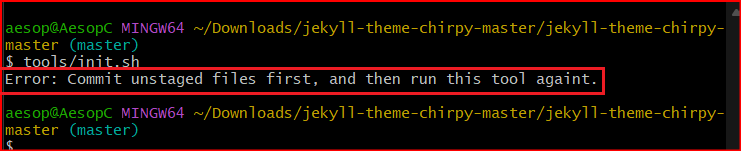

### 오류의 원인

첫 글에서 언급했듯이 처음에 Chirpy 테마 설치 시에 잘못된 점은  __.gitignor__ 파일에서 Gemfile.lock 항목을 지웠어야 하는데 오히려 디렉토리에 있는 Gemfile.lock 파일을 지워버리고   __.gitignor__  파일에 Gemfile.lock 항목을 또 한번 적어버린 점이다. 이렇게 하니 git push 에서 에러가 발생하는것은 당연한 것인지도 모른다.


(다른 뉴비분들이 나같은 같은 실수를 반복하지 않기를 바란다.)


__'jekyll-chirpy'__ , __Chirpy-테마'__ 로 구글링해보면 국내 블로그에서는 모두 동일한 실수를 반복하고 있는 것으로 보인다. 딱 한분 만이 원문 ( Chirpy 블로그의 __getting-started__ 포스트 ) 에 있는 내용과 반대로 하고 있다는 것을 인지했다고 밝히고 있지만 이걸 따르지 않으면서 오히려 자신의 방법이 __더 잘되어__ 좋은 방법이라고 하고 있다.  

안타까운 것은 로컬(localhost:4000)에서는 이런 종류의 오류가 걸러지지 않는다는 것이다. 뒤에도 나오지만 로컬에서 걸러지지 않는 또 다른 에러들 때문에 리모트에서 반복되는 빌드에러 (  __page build error__ )가 발생한다. 어쩌면 그분도 나처럼 또 다른 에러들 때문에 많이 고생한 것 인지도 모르겠다.  


### Windows PowerShell 에서 .sh script를 실행

아무튼 잘못된 점을 인지하고 곳바로 이를 바로 잡아 다시 시도하였다. 이 모든 오류의 출발점은 git bash command 창에서 `tools/init.sh`를 실행한 것이 아래에서 처럼 오류 메시지를 발생 시키고 올바른 진행이 되지않기 때문에 init.sh를 수동으로 진행하는 과정에서 발생한 것이다.

{:class="img-responsive"}


따라서 이번에는 여러종류의 다른 실행 창들에서  `tools/init.sh` 가 오류없이 잘 진행되는지 시도해보았다.  다행히 `windows PowerShell` 에서 오류 없이 잘 진행된다. 

{:class="img-responsive"}

`` bash`` 명령을 인식하지 못해서 이를 제거하고 입력했더니 잠시동안 작은 창하나가 생겨난 후에 사라졌다.
_posts 디렉토리에 모든 md 파일들이 지워져있는 것을 보니 명령이 잘 실행된 것이라고 생각되었다. 
    
    
### 걸러지지 않는 ERROR 1 - EXIT CODE 16

무사히 잘 진행되는가 싶었지만 page build과정에서 또 다시 에러가 발생하는데 


{:class="img-responsive"}


이번에는 에러를 잘 추적하여 에러 문구를 구글링하고 해결방법을 찾았다.


``` Ruby
 bundle lock --add-platform x86_64-linux 
```

이걸 명령 창에서 실행하였다.  __github desktop__ 을 살펴 보니 방법 파일이 몇 군데 변경된 것을 알 수 있었다. 이걸 다시 push하니 이번엔 build 과정이 에러없이 잘 진행되었다.
(사람들은 github GUI 프로그램으로 __github desktop__ 보다는 __sourcetree__ 를 추천하지만 나같은 뉴비들에게는 이런 부분을 알 수 있게 해준다는 점에서 __github desktop__ 이 유용성이 아주 없는 것도 아닌 것 같다. 나중에 빌드 에러도 아니면서 사이트 접속이 않되는 상황을 마주했는데  이 파일을 원상복귀하고 다시 ``bundle lock --add-platform x86_64-linux`` 명령을 입력하는 방법으로 해결했기 때문이다. )  
  


(  버전 5.0 이전 버전 의 README.MD 파일을 살펴보면 위 명령은 linux 가 아닌 시스템인 경우에 필요한 내용이라고 하는데 5.0 이상 버전 배포 과정에서 실수로 삭제된 것 같다. )

### 걸러지지 않는 ERROR 2 - EXIT CODE 1

이번 에러는 post글 첨부파일 이미지나 favicon같은 것들로 부터 발생했다.
  
  


테마 변경 과정에서 실수로 첨부파일 이미지를 디렉토리에 넣지 않았다. 아예 첨부 이미지를 지워버렸다.


테마의 설명파일에 소개된 대로 favicon을 제작해 설치했으나 파일명이 다른 이미지가 있었다. 이미지 파일명을 내부코드와 동일하게 변경했다.
    <br>

### 그 밖의 오류들
 <br>

 - 걸러지지만 쉽지 않았던 오류  
    <br>
   이글을 쓰는 중에 발생한 것인데 이미지 첨부를 위해서 편리한 마크다운 에디터로 typora(테디노트 님 추천)가 있지만 VS Code도 그리 나쁘지는 않았다. 그런데 글을 쓰는 과정에서는 VS Code창에서 첨부 이미지가 잘 표시되었지만 브라우저(로컬 ,localhost:4000 ) 에서는 404에러가 발생했다. 

    _shift_ 키를 누른 상태에서 이미지를 끌어다 놓으면
    <br>
    ``  ``
    <br>
    이런 코드가  자동으로 생성되면서 이미지를 표시하게 된다. 이때 이 주소 표시는 에디터에서는 별 문제가 없지만 실제 지킬 사이트에서는 앞의  __. .__ 을 지워주어야 한다.  
     <br> <br> 


 - 모바일에서 갑자기 pc 모드로 접속되는 오류

    |   |            |
    |------------------------------------|--------------------------------------|
    |                          정상일 때 |                         오류난 상태 |


    <br>
   몇몇 사이트에 질문도 올려보았지만 이건 아직도 원인을 알 수 없고 사이트를 전부 지우고 다시 만들어서 해결해야 했다.  
   <br/> <br/>
   
### 새로운 시도 

- 대부분의 블로그에서 gh-pages 브랜치가 자동으로 생성되는 것을 언급하지만 내 경우에는 그렇지 않아서 master 브랜치에서 포스팅 중이다.
그런데 어느 블로그의 댓글에서 내 경우와 동일한 현상을 질문을 하신 분에 대하여 
``요즘은  action에서 source를 github actions로 변경만 하시면 된다`` 
라는 답변을 주신 분을 발견했다.   이건 아마 __pages__  에서 __source__ 를 __Github Actions__ 로 바꾸면 된다는 뜻으로 해석되었다.
 그대로 적용해 놓고 변화를 관찰하기로 했다.
  (아래 그림 참조)


   <div> 
   <div>  
    <div>  


<br>

<br>

  글의 완성도를 높이고 싶어서 조금씩 수정하고 커밋 푸쉬를 하고 나면 또 오타도 발견되고 해서 하루에도 몇번씩 커밋 푸쉬를  시도하게 되는데 SITE가 어딘가 불안해서 page build 과정에서 에러가 없는데도 불구하고 페이지가 제대로 표시되지 않고  ``--- layout: home # Index page ---`` 이렇게 나타나는 경우가 발생하고 있다. 이걸 해결하기 위해 임시로는 앞서 언급했던 것처럼 `Gemfile.lock` 파일을 원상복구했다가   ``bundle lock --add-platform x86_64-linux`` 를 실행하는 방법을 활용하고 있는데 어쩌면 이런 문제도 해결될 수 있지 않을까 기대해본다.   
 <br>
### 몇 가지 Tips

<br>

- remote 사이트 clone 하는 local 디렉토리 위치

 자료들을 보면 로컬 디렉토리는 어디 있어도 무방하다고 하면서 주로 user 디렉토리 밑에 새로운 빈 디렉토리를 만들고 여기서 clone 명령을 진행한다. 하지만 내 경우 나중에 cd 명령으로 여기 위치까지 찾아 들어오는 것이 귀찮고 번거로와서 루트(C:)에서 clone 했다.
 하지만 간편한 방법을 알게 되었다.

 파일 관리자를 열고 __shift__ 키를 누른 상태로 디랙토리 위에서 오른쪽 마우스를 클릭하면 메뉴바가 뜨는데 이때 __터미널에서 열기__ 를 누르지 말고 __더 많은 옵션표시__ 를 선택하면 나머지 메뉴가 열린다. 이때 다양한 터미널 종류들 중에서 적당한 것을 선택하면 내가 원하는 디렉토리 위치에서 터미널이 열린다. 이때 적당한 것 이란 그냥 맘에 드는 것이 아니라 tools/init.sh가 실행되는 것을 뜻한다. 

<tr>
    <td> </td>
    <td  >  </td>
    <td  >   </td>
</tr>
<br/>
<br/>

- local 사이트를 mobile 에서 접속하고 싶을 때

<br/>

Android Studio에서 Virtual Device를 작동시키고 Chrome브라우저를 열어서 __10.0.2.2:4000__ 에 접속한다.
<br/><br/>


### 마치면서..

예전에 잠시 경험해보았던 __word press__ 에 비해서 작업이 수월할 것으로 기대하고 시작했는데 의외의 복병을 만나서 괜한 시간을 많이 허비했다. 

( __word press__ 는 알맞는 테마를 고르는 것도 어렵고 이후의 커스터마이징과 여러가지 plugin 설치 그리고 플랫폼과 테마 뿐아니라 여러가지 플러그인의 버전 업그레이드에 지속적으로 관리가 필요했다. 특히 __site hosting비용__ 을 지불해야하는 점까지 고려하면 여간 손이 많이 가는 일이 아니다. )

__Flutter__ 를 배우겠다고 나섰다가 __블로그__ 에서 헤매고 있다. 방향을 다시 회복하는데 시일이 걸릴 것 같다. ㅎㅎㅎ
마친다.

